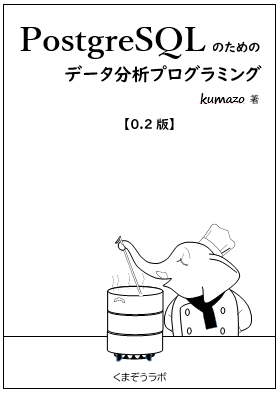

# PostgreSQL のためのデータ分析プログラミング




[サポートページ](http://kumazo.github.io/postgres-analytics/) 


## ■ 改版履歴

* 2019-09-22 0.2版（印刷書籍）  
技術書典7 にて領布。ご購入ありがとうございます！

## ■ 正誤情報

間違いや誤植のご指摘は kumazolabo@gmail.com までお知らせください。

### 【0.2版】

* **全体**  
なぜか数式が正しく展開されていません。[AsciiMath](http://asciimath.org/)記法なので脳内変換してください。

* **p27-p28**  
「元号年」のサンプルコードにおいて、「令和元年」が「令和1年」と出力されてしまいます。
同ソースコードのユーザ定義関数（jp_era）を以下のSQLに訂正します。

```sql
create or replace function ja_era(d date) returns text
as $$
  with
  era(name, period) as (
    values
      ('明治', '[1868-10-23, 1912-07-29]'::daterange),
      ('大正', '[1912-07-30, 1926-12-24]'),
      ('昭和', '[1926-12-25, 1989-01-07]'),
      ('平成', '[1989-01-08, 2019-04-30]'),
      ('令和', '[2019-05-01,]')
  ),
  y as (
    select name, date_part('year', d) - date_part('year', lower(period)) + 1 as nen
    from era where period @> d
  )
  select name || case when nen = 1 then '元' else nen::text end || '年' from y;
$$ language sql;
```

* **p44**  
plpytho3u のインストール説明の箇所で[PostgreSQLの公式イメージ](https://hub.docker.com/_/postgres)が「ubuntu」ペースとありますが、正しくは「**Debian**」ベースです。[postgre:11](https://github.com/docker-library/postgres/blob/9d8e2448436b2af1ea715822c2d209d493760007/11/Dockerfile)はdebian:stretch-slim から作成されています。

* **p61** SQLソース中  
2行目あたり  
誤  `        rpad('', least(character_maximum_length - 10, 100), fill) as val`  
正  `        rpad('', least(character_maximum_length, 100), fill) as val`  
32行目あたり  
誤
```sql

                  dummy
-----------------------------------------------------------------------------
 {
     "name": "hogeho",
     "category": "hogehogehogehogehogehogehogeho",
     "description": "hogehogehogehogehogehogehogehogehogehogehogehogehogehogehogehogehogehogehogehogehogehogehogehogehoge"
 }
```
正  
```sql
                                                           dummy                                                           
---------------------------------------------------------------------------------------------------------------------------
 {                                                                                                                        +
     "name": "hogehogehogehoge",                                                                                          +
     "category": "hogehogehogehogehogehogehogehogehogehoge",                                                              +
     "description": "hogehogehogehogehogehogehogehogehogehogehogehogehogehogehogehogehogehogehogehogehogehogehogehogehoge"+
 }
```

* **p62** 4行目あたり  
タイプミス　誤「OVERIING USER VALUEを～」⇒　正「OVERI**D**ING USER VALUEを～」

* **p64** SQLソース中  
21行目あたり  
誤 `      over(rows between 2 preceading and 1 preceding) as pre,`  
正 `      over(rows between 2 preceding and 1 preceding) as pre,`  
下から１３行目あたり  
誤 `      markov as mk inner join dict as d on mk.next = d.pre`  
正 `      markov as mk inner join dict as d on mk.next = ng.pre`  

* **p65** 1行目あたり  
抜け　誤「テキスト（約字）」⇒ 正「テキスト（約**6000**字）」
* **p95** 下から７行目あたり  
編集ミス　誤「NEologdは辞書を最新語で更新できるもで、辞書を ～ 新単語にも対応できる。」⇒
正 「NEologd は複合語レベルの単語を形態素として登録した辞書で、Mecabの辞書をNEologdに差し替えると、意味の通る適切な単語が抽出されるほか、流行語など最新の単語も抽出されるようになる。」

## ■ ソースコード

 **《準備中》**

## ■ 参考文献

本書 0.2版では、時間的制約のため参考とさせていただいた書籍、サイト、資料等の一覧を掲載することができませんでした。

まだ、整理中ですが、ここに一部を紹介させていただきます。

* **【資料】**
  * PostgreSQL 11.4文書  
  https://www.postgresql.jp/document/11/html/index.html
  * PostgreSQL: Documentation: 12: PostgreSQL 12beta4 Documentation  
  https://www.postgresql.org/docs/12/index.html
  * 国民の祝日について - 内閣府  
  https://www8.cao.go.jp/chosei/shukujitsu/gaiyou.html?PHPSESSID=013ef321a0aea2e19e3937010efdf4e3
  * URL Standard （日本語訳）   
  https://triple-underscore.github.io/URL-ja.html
  * RFC 3986 - Uniform Resource Identifier (URI): Generic Syntax  
  https://tools.ietf.org/html/rfc3986
  * ISO IEC TR 19075   
  SQL Technical Report. Part 6: SQL support for JavaScript Object Notation (JSON)  
  http://standards.iso.org/ittf/PubliclyAvailableStandards/c067367_ISO_IEC_TR_19075-6_2017.zip

* **【書籍】**
  * 『データサイエンスのための統計学入門 ――予測、分類、統計モデリング、統計的機械学習とRプログラミング』 Peter Bruce、Andrew Bruce 著、黒川 利明　訳、大橋 真也　技術監修、O'Reilly Japan, Inc.  
  https://www.oreilly.co.jp/books/9784873118284/
  * 『プログラマのためのSQL 第4版 すべてを知り尽くしたいあなたに』 ジョー・セルコ 著、ミック 監訳、翔泳社  
  https://www.shoeisha.co.jp/book/detail/9784798128023
  * 『データ集計・分析のためのSQL入門』　株式会社ALBERT 他 著、マイナビ  
  https://book.mynavi.jp/ec/products/detail/id=28392
  * 『ビッグデータ分析・活用のためのSQLレシピ』　加嵜長門、田宮直人 著、マイナビ  
  https://book.mynavi.jp/ec/products/detail/id=65863
  * 『前処理大全［データ分析のためのSQL/R/Python実践テクニック］』　本橋智光 著、株式会社ホクソエム　監修、技術評論社  
  https://gihyo.jp/book/2018/978-4-7741-9647-3  
  * 『10年戦えるデータ分析入門　SQLを武器にデータ活用時代を生き抜く』　青木峰郎 著、SB Creative  
  https://www.sbcr.jp/product/4797376272/
  * 宮沢賢治 オツベルと象 青空文庫  
  https://www.aozora.gr.jp/cards/000081/files/466_42316.html

* **【参考】**
  * 『篠田の虎の巻』第10弾 公開！PostgreSQL 11 の正式版に対応！ - Hewlett Packard Enterprise Community  
  https://community.hpe.com/t5/Enterprise-Topics/%E7%AF%A0%E7%94%B0%E3%81%AE%E8%99%8E%E3%81%AE%E5%B7%BB-%E7%AC%AC10%E5%BC%BE-%E5%85%AC%E9%96%8B-PostgreSQL-11-%E3%81%AE%E6%AD%A3%E5%BC%8F%E7%89%88%E3%81%AB%E5%AF%BE%E5%BF%9C/ba-p/7023249?profile.language=ja#.XYag-yj7S1v
  * 本の虫: うっかりチューリング完全になっちゃったもの  
  https://cpplover.blogspot.com/2013/10/blog-post_20.html
  * Linuxコマンドをfile_fdwの入力として使う。 - Qiita  
  https://qiita.com/nuko_yokohama/items/1044020576d3f5affb53
  * file_fdw | Let's Postgres   
  https://lets.postgresql.jp/documents/technical/contrib/file_fdw
  * 国民の祝日 - Wikipedia  
  https://ja.wikipedia.org/wiki/%E5%9B%BD%E6%B0%91%E3%81%AE%E7%A5%9D%E6%97%A5
  * 国民の祝日に関する法律 - Wikipedia  
  https://ja.wikipedia.org/wiki/%E5%9B%BD%E6%B0%91%E3%81%AE%E7%A5%9D%E6%97%A5%E3%81%AB%E9%96%A2%E3%81%99%E3%82%8B%E6%B3%95%E5%BE%8B
  * 春分・秋分点通過日時の計算 真木のホームページ  
  http://park12.wakwak.com/~maki/equinox21.htm
  * 暦Wiki/季節/季節のめぐりの周期 - 国立天文台暦計算室   
  https://eco.mtk.nao.ac.jp/koyomi/wiki/B5A8C0E12FB5A8C0E1A4CEA4E1A4B0A4EAA4CEBCFEB4FC.html
  * Mersenne Twister: A random number generator (since 1997/10)   
  http://www.math.sci.hiroshima-u.ac.jp/~m-mat/MT/mt.html
  * あなたの使っている乱数、大丈夫？ 松本 眞 - 広島大学  
  http://www.math.sci.hiroshima-u.ac.jp/~m-mat/TEACH/ichimura-sho-koen.pdf
  * random --- 擬似乱数を生成する — Python 3.7.4 ドキュメント  
  https://docs.python.org/ja/3/library/random.html
  * Google Chromeが採用した、擬似乱数生成アルゴリズム「xorshift」の数理 – びりあるの研究ノート  
  https://blog.visvirial.com/articles/575
  * ボックス＝ミュラー法 - Wikipedia  
  https://ja.wikipedia.org/wiki/%E3%83%9C%E3%83%83%E3%82%AF%E3%82%B9%EF%BC%9D%E3%83%9F%E3%83%A5%E3%83%A9%E3%83%BC%E6%B3%95
  * 乱数にコクを出す方法について - Togetter  
  https://togetter.com/li/1044668
  * 逆関数法 - Wikipedia  
  https://ja.wikipedia.org/wiki/%E9%80%86%E9%96%A2%E6%95%B0%E6%B3%95
  * パレート分布 - Wikipedia  
  https://ja.wikipedia.org/wiki/%E3%83%91%E3%83%AC%E3%83%BC%E3%83%88%E5%88%86%E5%B8%83
  * Pareto distribution - Wikipedia  
  https://en.wikipedia.org/wiki/Pareto_distribution
  * Identity columns - Qiita  
  https://qiita.com/nuko_yokohama/items/7d0d5525bcefaa3332ce
  * PostgreSQL 9.5のTABLESAMPLE句 - Qiita  
  https://qiita.com/sawada_masahiko/items/80ec96f3c19e8fcf3b23
  * oknj/textsearch_ja: 形態素解析を使用した日本語全文検索の、PostgreSQL組み込み型モジュール。   
  https://github.com/oknj/textsearch_ja
  * TABLESAMPLE Implementation - PostgreSQL wiki   
  https://wiki.postgresql.org/wiki/TABLESAMPLE_Implementation
  * PostgreSQL: Re: Expression to construct a anonymous record with named columns?   
  https://www.postgresql.org/message-id/CAHyXU0xHDZO6%3D0XjEEK-sQL-4Gbp2Gh-f-LZieZFdGEw%3DzWJnA%40mail.gmail.com


